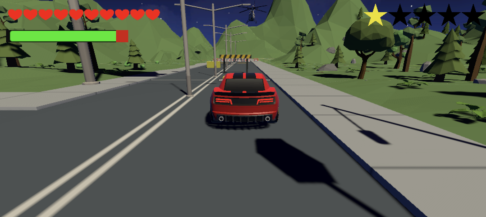
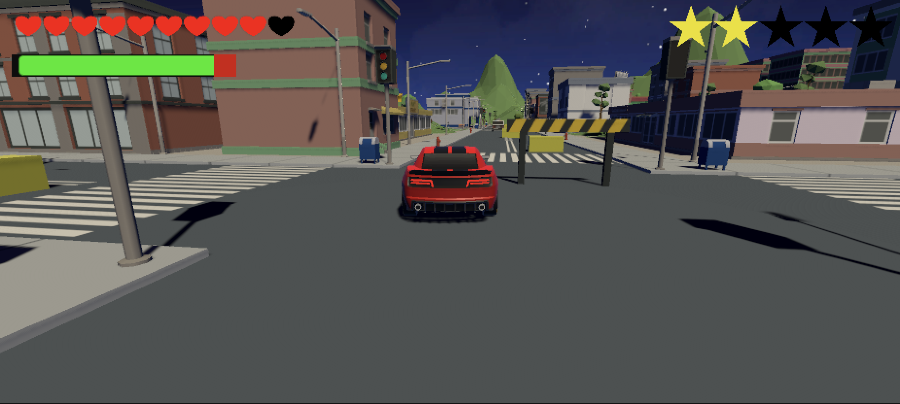
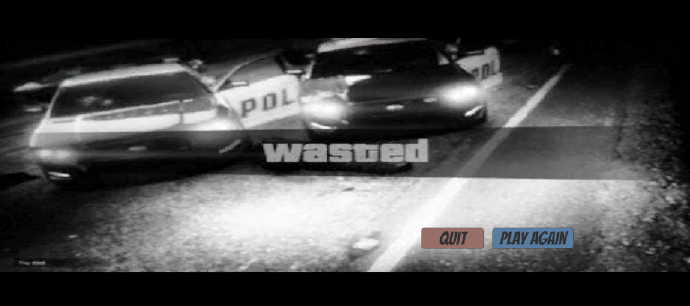

# 🏙️ GTA Alai – AI-Driven Car Simulation Game in Unity

**Developed by:** Miguel Ángel Huamani Salinas & Jorge Ibinarriaga Robles

---

## 🎮 About the Game

*GTA Alai* is a third-person 3D driving simulation game built with Unity, where the player explores a dynamic city while observing intelligent vehicle behavior. Rather than being a traditional action game, this project focuses on **autonomous vehicle behavior**, **AI-driven interaction**, and **modular gameplay logic**.

The environment includes free exploration, traffic-like behaviors, and interaction with AI-controlled vehicles that respond to the player's presence.

---

## 🤖 Intelligent Car Behaviors

Each vehicle in the game is controlled by a modular AI system that enables:

- 🚗 **Patrolling across waypoints** with smooth transitions.
- 🧠 **Obstacle detection and reaction**, such as slowing down or stopping.
- 👁️ **Player tracking** logic for adaptive pursuit behavior.
- 🔁 **State switching** with Finite State Machines (FSM), supporting modes like *Idle*, *Driving*, and *Chasing*.

The system was implemented using well-established design patterns and object-oriented principles for maximum scalability and reusability.

---

## 🧱 Architecture & Technologies

The game architecture was built with clarity and flexibility in mind:

- **Unity 3D** for game development and physics.
- **C#** for scripting all behaviors and UI logic.
- **Design Patterns** including:
  - `Strategy` for selecting movement logic
  - `State` for AI behavior transitions
  - `Observer` for in-game events
  - `Command` for modular UI actions

---

## 🕹️ How to Play

You control a getaway driver who has just committed a crime. Your mission is to escape the police by reaching the extraction point at each level without being captured or running out of lives.

The game consists of **5 increasingly difficult levels**. As you progress:
- More police cars are spawned to chase you.
- You must navigate through obstacles such as fences and slowing zones.
- A **friendly helicopter** will appear above the extraction point to guide you toward the escape.

### 🎯 Objective
Reach the helicopter's location on each level to escape the city and advance to the next level.

### Level 1 Gameplay

### Level 2 Gameplay

---

### 🎮 Controls

- `←`, `→` – Steer left and right  
- `↑` – Accelerate  
- `↓` – Brake or reverse  
- `SPACE` – Hard brake  
- `R` – Reset position (in case you're stuck)

---

### ❤️ Health & Lives

- The top-left corner displays your remaining lives and current health bar.
- You start with **10 lives**, and your health starts at **100** per life.
- Colliding with:
  - A **police car** reduces health by **50**
  - A **barrier** reduces health by **10**
- Losing all health removes one life. Losing all lives ends the game.

---

### ⚠️ Additional Hazards

- **Yellow cubes** on the map represent **Speed Debuffers**.
- Driving through them reduces your speed by 25 units, making you an easier target.

---

### 🏁 Ending Conditions

- **Victory Scene**: Completing all 5 levels without losing all lives. 

- **Game Over Scene**: Losing all lives before reaching the end.

---

